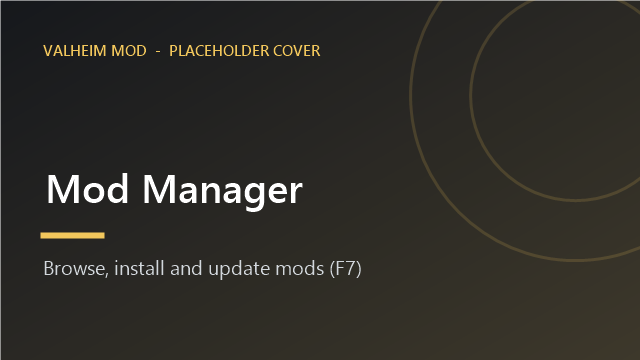

<div align="center">



# 🧙 Valheim Mod Manager

**Press F7. Pick mods. Play.**
An in-game mod manager for Valheim that finds mods on GitHub, installs them, keeps them updated and reloads them without restarting the game.


[](LICENSE)
[](CONTRIBUTING.md)

</div>

---

## ✨ What you get

| | |
|---|---|
| 🧩 **My mods** | Everything you have installed, updates first, with cover pictures, descriptions and one-click **Update**, **Reload**, **Disable**. |
| 🛍️ **Browse** | Every mod from every source you watch, grouped by source. Pick what you want and click **Install**. |
| 👥 **Players** | See who in your world has which mods, and the mods your friends have that you do not, with a button to get them. |
| 🌐 **Sources** | The main repos are built in, the community adds more through pull requests, and you can add your own. |
| ⚙️ **Settings** | Auto-update on start, chat notifications, window size and developer tools. |

- ⚡ **Hot reload.** Updated mods reload in the running game. Mods that cannot do that say "Restart the game".
- 🔓 **No login needed.** Public repos work without a GitHub token (a read-only token is only needed for private repos).
- 🛡️ **You stay in charge.** Mods from the community sources are only listed. Nothing installs until you click Install.

## 🚀 Install

**Windows (Steam), easiest:** follow [`installer/INSTALL.md`](installer/INSTALL.md). It is written so an AI assistant can do it for you, or run `installer/install.ps1` yourself. It installs BepInEx, ScriptEngine, this manager and the main mods.

**Already use BepInEx?** Copy `ModUpdater.dll` and `ModUpdater.pdb` from [`dist/`](dist/) into `BepInEx/scripts`, start the game and press **F7**.

## 🗺️ A quick tour

1. Press **F7** in game.
2. **Refresh** checks every source. The chip at the top says how many updates are ready.
3. **Browse** lists what is on offer. Click **Details** on a card for the full description and **Install** to get it.
4. **Update all** brings everything up to date. Most mods reload instantly.
5. In **Players**, a friend's mods you are missing show up with **Install** (or **Add** if they use a source you do not watch yet).

## 🌍 Sources and sharing your own mods

A **source** is just a GitHub folder (`dist/`) with a `manifest.json` and the mod DLLs. That is all the manager needs, so anyone can run one.

| Kind | Where it comes from | Behaviour |
|---|---|---|
| **Main** | Built in: this repo and [valheim-mods](https://github.com/HardHeadHackerHead/valheim-mods) | Can auto-update (Settings) |
| **Community** | [`sources.json`](sources.json) in this repo, added by pull request | Watched by default, browse only, you can stop watching any |
| **Yours** | Added in the Sources tab | Browse only, you confirm before adding |

**Want your mods in the list?** Copy [`template/`](template/) into a new public repo (it has a ready-to-build example mod, the publish script and a cover-image slot), then open a pull request that adds your repo to [`sources.json`](sources.json). The checklist is in [CONTRIBUTING.md](CONTRIBUTING.md).

## 🔒 Is it safe?

Mods are code, and they run inside your game with full access to your PC. The manager is built around that:

- Only mods from sources you watch are ever shown, and only mods from the **main** sources can update automatically.
- Adding a source takes a deliberate second click, and every community suggestion is reviewed in a pull request before it reaches anyone.
- Downloads are limited to `.dll`, `.pdb` and small cover images, written only into `BepInEx/scripts`.

Still, only install mods from people you trust.

## 🛠️ Build it yourself

```powershell
# needs the .NET SDK and Valheim with BepInEx; point VALHEIM_DIR at the game folder
$env:VALHEIM_DIR = "C:\Program Files (x86)\Steam\steamapps\common\Valheim"
dotnet build mods/ModUpdater -c Release     # builds and copies into BepInEx\scripts
.\publish.ps1                                # writes dist/ (DLLs, cover and manifest.json)
```

<details>
<summary>How it works under the hood</summary>

The manager reads each source's `manifest.json` (mods, versions, files, optional restart note and cover) and its file list through GitHub's API. It compares versions and Git file hashes, downloads only what changed, and reloads just those mods through ScriptEngine. Covers are fetched once and cached by hash. Players share which mods they have through Valheim's own routed RPC messages, so no server mod is needed.

</details>

## 🤝 Contributing

Suggest a mod repo ([CONTRIBUTING.md](CONTRIBUTING.md)), report a bug, or send a fix. Pull requests are welcome.

## 📄 License

[MIT](LICENSE).
